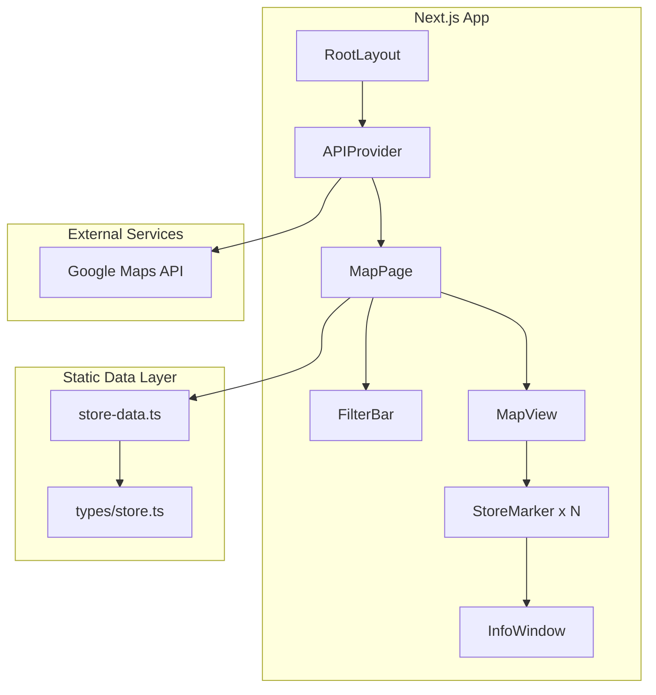
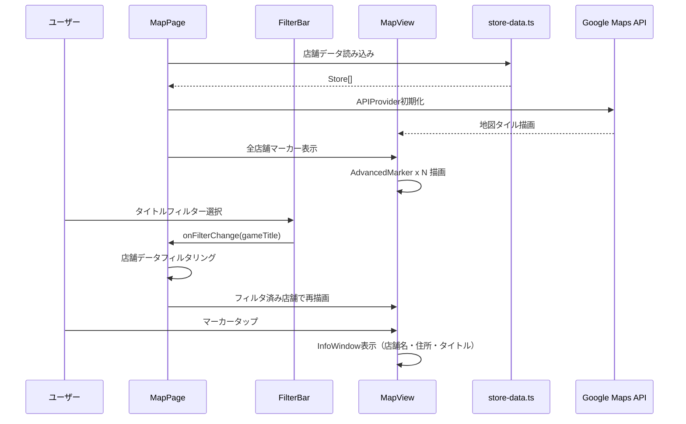

# 技術設計書

## 概要

**目的**: ラスサバ・イニブのアーケード設置店舗を地図上で可視化し、タイトル別のフィルタリングで目的の店舗を素早く発見できる体験を提供する。

**ユーザー**: ラスサバ・イニブをプレイするアーケードゲーマー（初期は関東圏の知人15名程度）がスマートフォンから店舗を検索する。

### ゴール
- 設置店舗を地図上にマーカーで視覚的に表示する
- タイトル別フィルタリングで必要な情報だけに絞り込める
- スマホから快適に操作できるモバイルファーストUI
- Vercelへの即座のデプロイが可能な構成

### ノンゴール
- 動的なデータ更新・CMS連携
- ユーザー認証・アカウント機能
- 店舗レビュー・評価機能
- ルート検索・ナビゲーション機能
- デスクトップ専用の最適化

## アーキテクチャ

### アーキテクチャパターン & バウンダリマップ



**アーキテクチャ統合**:
- **選択パターン**: 単一ページクライアントサイドアプリ — MVP規模（15名）に対してシンプルさを優先
- **境界分離**: UIコンポーネント層 / 静的データ層 / 外部API層の3層
- **既存パターン準拠**: steering/structure.mdに定義された`src/components/`、`src/data/`、`src/types/`のディレクトリパターンに従う
- **新規コンポーネントの根拠**: 各コンポーネントは単一責任を持ち、地図描画・フィルタリング・データ管理を分離

### 技術スタック

| レイヤー | 選定 / バージョン | 役割 | 備考 |
|---------|------------------|------|------|
| フレームワーク | Next.js 15 (App Router) | SSG + クライアントハイドレーション | Vercelデプロイ最適化 |
| 言語 | TypeScript 5.x (strict) | 型安全なデータ管理 | `any`禁止 |
| 地図ライブラリ | @vis.gl/react-google-maps ^1.7 | Google Maps React統合 | Google公式推奨、詳細は`research.md`参照 |
| スタイリング | Tailwind CSS 4.x | ユーティリティファーストCSS | スマホファーストレスポンシブ |
| ホスティング | Vercel | 静的サイトデプロイ | 無料枠で十分 |
| 外部API | Google Maps JavaScript API | 地図タイル・ジオコーディング | Map ID必須（AdvancedMarker使用） |

## システムフロー



## 要件トレーサビリティ

| 要件 | 概要 | コンポーネント | インターフェース | フロー |
|------|------|--------------|----------------|--------|
| 1.1 | 画面全体に地図表示 | MapView | MapViewProps | 初期化フロー |
| 1.2 | 関東圏を初期表示 | MapView | DEFAULT_CENTER定数 | 初期化フロー |
| 1.3 | マーカー表示 | StoreMarker | StoreMarkerProps | 初期化フロー |
| 1.4, 1.5 | ピンチ・スワイプ操作 | MapView | Google Maps標準機能 | — |
| 2.1, 2.2, 2.3 | マーカータップで情報表示 | StoreMarker | InfoWindowコンテンツ | マーカータップフロー |
| 2.4 | タイトル別マーカー色分け | StoreMarker | GameTitle→Pin色マッピング | — |
| 3.1 | フィルタリングUI | FilterBar | FilterBarProps | フィルタフロー |
| 3.2, 3.3, 3.4 | タイトル別フィルタ切替 | FilterBar, MapPage | FilterOption型 | フィルタフロー |
| 3.5 | 初期状態で全表示 | MapPage | DEFAULT_FILTER定数 | 初期化フロー |
| 4.1, 4.2, 4.3 | 店舗データ保持 | store-data.ts | Store型 | — |
| 4.4 | 静的バンドル | store-data.ts | TSファイルimport | — |
| 5.1, 5.2, 5.3, 5.4 | スマホファーストUI | 全コンポーネント | Tailwind CSS | — |
| 6.1 | Next.js/Vercel構成 | プロジェクト全体 | next.config.ts | — |
| 6.2 | 3秒以内表示 | 全コンポーネント | — | 初期化フロー |
| 6.3 | 外部API非依存 | store-data.ts | 静的import | — |

## コンポーネント & インターフェース

| コンポーネント | レイヤー | 責務 | 要件カバレッジ | 主要依存 | コントラクト |
|--------------|---------|------|--------------|---------|------------|
| MapPage | ページ | フィルタ状態管理・データ供給 | 1.1-1.3, 3.2-3.5, 5.4 | FilterBar (P0), MapView (P0) | State |
| MapView | UI | 地図描画・マーカー配置 | 1.1-1.5, 2.4 | @vis.gl/react-google-maps (P0) | — |
| StoreMarker | UI | 個別マーカー・InfoWindow | 2.1-2.4 | MapView (P0) | — |
| FilterBar | UI | タイトルフィルタ切替 | 3.1-3.5 | MapPage (P0) | — |
| store-data.ts | データ | 静的店舗データ | 4.1-4.4 | — | — |

### ページレイヤー

#### MapPage

| フィールド | 詳細 |
|-----------|------|
| 責務 | フィルタ状態の管理、店舗データのフィルタリング、子コンポーネントへのデータ供給 |
| 要件 | 1.1-1.3, 3.2-3.5, 5.4 |

**責務 & 制約**
- アプリの唯一のページコンポーネント（`src/app/page.tsx`）
- `'use client'`ディレクティブ必須（地図ライブラリがクライアントサイド）
- フィルタ状態（`activeFilter`）をuseStateで管理
- フィルタ状態に基づいて店舗データを絞り込み、MapViewに渡す

**依存関係**
- Outbound: FilterBar — フィルタUI描画 (P0)
- Outbound: MapView — 地図・マーカー描画 (P0)
- Outbound: store-data.ts — 店舗データ取得 (P0)

**コントラクト**: State [x]

##### 状態管理

```typescript
type FilterOption = 'all' | 'jojo-ls' | 'gundam-exvs'

// MapPage内の状態
const [activeFilter, setActiveFilter] = useState<FilterOption>('all')

// フィルタリングロジック
function filterStores(stores: Store[], filter: FilterOption): Store[]
```

**実装メモ**
- `filterStores`はフィルタが`'all'`の場合全店舗を返し、それ以外は対応タイトルの店舗のみ返す
- 両方のタイトルを稼働する店舗は、どちらのフィルタでも表示される

### UIレイヤー

#### MapView

| フィールド | 詳細 |
|-----------|------|
| 責務 | Google Mapsの描画とマーカーの配置 |
| 要件 | 1.1-1.5, 2.4 |

**依存関係**
- Inbound: MapPage — フィルタ済み店舗データ (P0)
- External: @vis.gl/react-google-maps — Map, AdvancedMarker (P0)

```typescript
interface MapViewProps {
  stores: Store[]
}
```

**実装メモ**
- `defaultCenter`/`defaultZoom`で非制御モードを使用（関東圏: `{lat: 35.68, lng: 139.77}`, zoom: 10）
- 各店舗に対してStoreMarkerをレンダリング

#### StoreMarker

| フィールド | 詳細 |
|-----------|------|
| 責務 | 個別店舗のマーカー描画とInfoWindow表示 |
| 要件 | 2.1-2.4 |

**依存関係**
- Inbound: MapView — 店舗データ (P0)
- External: @vis.gl/react-google-maps — AdvancedMarker, Pin, InfoWindow (P0)

```typescript
interface StoreMarkerProps {
  store: Store
}
```

**実装メモ**
- `useAdvancedMarkerRef`フックでマーカーとInfoWindowを接続
- Pinコンポーネントの`background`プロップでタイトル別色分け（ラスサバ: 紫系、イニブ: 緑系）
- 両タイトル稼働店舗はグラデーションまたは特別色を使用
- マーカータップでInfoWindow表示/非表示をuseStateで制御
- InfoWindow内に店舗名・住所・対応タイトルを表示

#### FilterBar

| フィールド | 詳細 |
|-----------|------|
| 責務 | タイトルフィルタの切り替えUI |
| 要件 | 3.1-3.5 |

**依存関係**
- Inbound: MapPage — 現在のフィルタ状態 (P0)
- Outbound: MapPage — フィルタ変更コールバック (P0)

```typescript
interface FilterBarProps {
  activeFilter: FilterOption
  onFilterChange: (filter: FilterOption) => void
}
```

**実装メモ**
- 3つのトグルボタン: 「すべて」「ラスサバ」「イニブ」
- 地図上部にオーバーレイ配置（地図表示を妨げない）
- アクティブ状態のボタンをハイライト表示
- タッチターゲット44px以上確保（モバイルアクセシビリティ）

### データレイヤー

#### store-data.ts

| フィールド | 詳細 |
|-----------|------|
| 責務 | 全設置店舗の静的データを型付き配列として提供 |
| 要件 | 4.1-4.4 |

**依存関係**
- なし（独立したデータソース）

**実装メモ**
- `src/data/stores.ts`にデータ配列をexport
- 公式ページから手動で収集したデータを格納
- 各店舗の緯度経度は住所からジオコーディングして事前取得

## データモデル

### ドメインモデル

```typescript
/** ゲームタイトル識別子 */
type GameTitle = 'jojo-ls' | 'gundam-exvs'

/** 設置店舗 */
interface Store {
  /** 一意な店舗ID */
  id: string
  /** 店舗名 */
  name: string
  /** 店舗住所 */
  address: string
  /** 緯度 */
  lat: number
  /** 経度 */
  lng: number
  /** 稼働タイトル（複数可） */
  games: GameTitle[]
}

/** フィルタ選択肢 */
type FilterOption = 'all' | GameTitle
```

**ビジネスルール & 不変条件**:
- 1店舗は1つ以上のGameTitleを持つ
- `games`配列は空であってはならない
- `id`は全店舗で一意
- `lat`/`lng`は有効な座標範囲内

### マーカー色マッピング

| タイトル | マーカー色 | 用途 |
|---------|----------|------|
| `jojo-ls`のみ | 紫 (#7B2FBE) | ラスサバ単独店舗 |
| `gundam-exvs`のみ | 緑 (#2E8B57) | イニブ単独店舗 |
| 両方 | オレンジ (#FF8C00) | 両タイトル稼働店舗 |

## エラーハンドリング

### エラー戦略
静的データのみのMVPのため、エラーハンドリングは最小限に抑える。

### エラーカテゴリ
- **Google Maps APIロード失敗**: ロード中表示の後、エラーメッセージを表示。ユーザーにリロードを促す
- **APIキー未設定**: 開発時にconsole.errorでAPIキー設定を案内

## テスト戦略

### ユニットテスト
- `filterStores`関数: 各フィルタオプションで正しい店舗のみ返すことを検証
- Store型のバリデーション: 全店舗データがStore型の不変条件を満たすことを検証

### 統合テスト
- FilterBar操作→MapView再描画: フィルタ切替で正しいマーカーセットが表示されることを検証

### E2Iテスト（将来）
- 初回ロード→地図表示→マーカー表示の一連フロー
- フィルタ切替→マーカー更新のフロー
