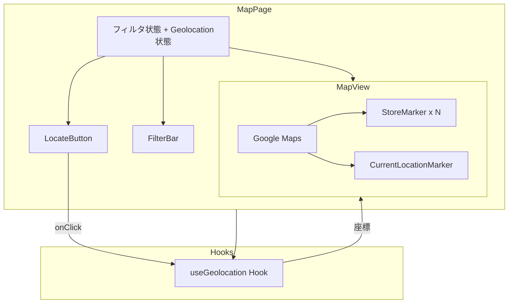
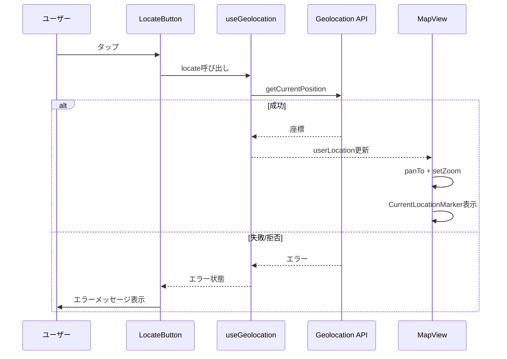

# 技術設計書

## 概要

**目的**: ユーザーの現在位置を取得し、地図を現在地に移動することで、近隣のゲームセンターを素早く発見できる体験を提供する。

**ユーザー**: 外出先のアーケードゲーマーがスマートフォンから最寄りの店舗を検索する。

**影響**: 既存のMapPage/MapViewに現在地取得機能を追加。既存のフィルタリング機能やマーカー表示には影響しない。

### ゴール
- ワンタップで現在位置を取得し、地図を移動
- 現在地マーカーで周辺店舗との位置関係を視覚化
- 既存機能（フィルタリング・マーカー表示）との完全な互換性

### ノンゴール
- リアルタイムの位置追跡（watchPosition）
- 距離順のソートやリスト表示
- 近隣店舗の距離表示
- ルート案内・ナビゲーション

## アーキテクチャ

### 既存アーキテクチャ分析
- MapPage（page.tsx）がフィルタ状態管理とコンポーネント統合を担当
- MapViewは非制御モード（`defaultCenter`/`defaultZoom`）でGoogle Maps描画
- FilterBarがフィルタUIを提供
- StoreMarkerが個別マーカー/InfoWindowを担当

### アーキテクチャパターン & バウンダリマップ



**アーキテクチャ統合**:
- **選択パターン**: 既存のMapPage中心パターンを拡張 — 新しいアーキテクチャ層を追加しない
- **既存パターン維持**: FilterBar/MapView/StoreMarkerの構造は変更なし
- **新規コンポーネントの根拠**:
  - `useGeolocation`: Geolocation APIのラッパー（テスタビリティと関心分離）
  - `LocateButton`: 現在位置取得UIの単一責任
  - `CurrentLocationMarker`: 現在地の視覚表現

### 技術スタック

| レイヤー | 選定 / バージョン | 役割 | 備考 |
|---------|------------------|------|------|
| ブラウザAPI | Geolocation API | 現在位置取得 | HTTPS必須（Vercelで対応済み） |
| 地図ライブラリ | @vis.gl/react-google-maps ^1.7 | useMapフックで地図制御 | 既存依存、追加パッケージ不要 |

## システムフロー



## 要件トレーサビリティ

| 要件 | 概要 | コンポーネント | フロー |
|------|------|--------------|--------|
| 1.1 | 現在位置取得ボタン表示 | LocateButton | — |
| 1.2 | Geolocation API呼び出し | useGeolocation | 位置取得フロー |
| 1.3 | 取得座標の使用 | useGeolocation, MapPage | 位置取得フロー |
| 2.1 | 現在位置マーカー表示 | CurrentLocationMarker | 位置取得フロー |
| 2.2 | 地図中心を現在位置に移動 | MapView (useMap) | 位置取得フロー |
| 2.3 | 現在位置マーカーの視覚的区別 | CurrentLocationMarker | — |
| 3.1 | 近隣店舗視認のズーム調整 | MapView (useMap) | 位置取得フロー |
| 3.2 | フィルタリングとの併用 | MapPage | — |
| 4.1 | 位置情報拒否時のエラー表示 | useGeolocation, LocateButton | エラーフロー |
| 4.2 | 位置取得失敗時のエラー表示 | useGeolocation, LocateButton | エラーフロー |
| 4.3 | 位置情報なしでの通常動作 | MapPage | — |

## コンポーネント & インターフェース

| コンポーネント | レイヤー | 責務 | 要件 | 主要依存 | コントラクト |
|--------------|---------|------|------|---------|------------|
| useGeolocation | Hook | ブラウザ位置情報の取得とエラーハンドリング | 1.2, 1.3, 4.1, 4.2 | Geolocation API (P0) | State |
| LocateButton | UI | 位置取得トリガーとエラー表示 | 1.1, 4.1, 4.2 | useGeolocation (P0) | — |
| CurrentLocationMarker | UI | 現在位置の地図上表示 | 2.1, 2.3 | @vis.gl/react-google-maps (P0) | — |
| MapView（拡張） | UI | 現在地への地図移動 | 2.2, 3.1 | useMap (P0) | State |

### Hookレイヤー

#### useGeolocation

| フィールド | 詳細 |
|-----------|------|
| 責務 | ブラウザGeolocation APIのラッパー。位置取得・ローディング状態・エラーを管理 |
| 要件 | 1.2, 1.3, 4.1, 4.2 |

**責務 & 制約**
- `navigator.geolocation.getCurrentPosition`を呼び出し、結果を状態として公開
- ローディング中はUI側で適切な表示を可能にする
- エラーコードに応じた日本語メッセージを提供

**依存関係**
- External: Geolocation API — 位置取得 (P0)

**コントラクト**: State [x]

##### 状態管理

```typescript
interface GeolocationState {
  location: { lat: number; lng: number } | null
  isLocating: boolean
  error: string | null
}

interface UseGeolocationReturn extends GeolocationState {
  locate: () => void
}
```

**実装メモ**
- `locate()`呼び出しで`isLocating: true`、成功で`location`更新、失敗で`error`設定
- Geolocation APIが利用不可の環境では即座にエラーを返す
- エラーメッセージ: PERMISSION_DENIED → 「位置情報の利用が許可されていません」、POSITION_UNAVAILABLE → 「現在位置を取得できません」、TIMEOUT → 「位置情報の取得がタイムアウトしました」

### UIレイヤー

#### LocateButton

| フィールド | 詳細 |
|-----------|------|
| 責務 | 現在位置取得ボタンの表示とエラーメッセージのトースト表示 |
| 要件 | 1.1, 4.1, 4.2 |

**依存関係**
- Inbound: MapPage — ボタン配置 (P0)
- Outbound: useGeolocation — 位置取得トリガー (P0)

```typescript
interface LocateButtonProps {
  isLocating: boolean
  error: string | null
  onLocate: () => void
}
```

**実装メモ**
- 地図右下にFABスタイルで配置（FilterBarと干渉しない位置）
- ローディング中はスピナー表示、ボタン無効化
- エラー発生時はボタン下部にトーストメッセージを一定時間表示
- タッチターゲット44px以上

#### CurrentLocationMarker

| フィールド | 詳細 |
|-----------|------|
| 責務 | 現在位置を青い円マーカーで地図上に表示 |
| 要件 | 2.1, 2.3 |

**依存関係**
- Inbound: MapView — 座標データ (P0)
- External: @vis.gl/react-google-maps — AdvancedMarker (P0)

```typescript
interface CurrentLocationMarkerProps {
  position: { lat: number; lng: number }
}
```

**実装メモ**
- AdvancedMarkerにカスタムHTML要素（青い円 + CSSパルスアニメーション）を渡す
- 店舗マーカー（Pin）とは明確に異なる見た目

#### MapView（拡張）

| フィールド | 詳細 |
|-----------|------|
| 責務 | 既存のMapViewにuserLocation受け渡しと地図移動機能を追加 |
| 要件 | 2.2, 3.1 |

**拡張インターフェース**

```typescript
interface MapViewProps {
  stores: Store[]
  userLocation?: { lat: number; lng: number } | null
}
```

**実装メモ**
- `userLocation`が新たに設定された時、`useMap`フックで`map.panTo()`と`map.setZoom(14)`を実行
- `userLocation`がnullまたは未指定の場合、既存動作（defaultCenter/defaultZoom）を維持
- `useEffect`で`userLocation`の変化を検知し、地図を移動
- CurrentLocationMarkerを`userLocation`がある場合のみレンダリング

## エラーハンドリング

### エラー戦略
位置情報取得はオプション機能であり、失敗しても既存機能に影響しない。エラーはユーザーに通知するが、アプリの動作は継続する。

### エラーカテゴリ
- **PERMISSION_DENIED**: ユーザーが位置情報を拒否 → 日本語エラーメッセージ表示、通常の地図表示を維持
- **POSITION_UNAVAILABLE**: 位置情報が利用不可 → 日本語エラーメッセージ表示、通常の地図表示を維持
- **TIMEOUT**: 位置取得タイムアウト → 日本語エラーメッセージ表示、再試行可能
- **Geolocation API非対応**: 古いブラウザ → エラーメッセージ表示、ボタンは表示するが即エラー

## テスト戦略

### ユニットテスト
- `useGeolocation`: 成功時に座標を返す、各エラーコードで適切なメッセージを返す、ローディング状態の遷移
- 日本語エラーメッセージのマッピング

### 統合テスト
- MapPage: 位置取得後にMapViewにuserLocationが渡される
- MapView: userLocation変更時にpanTo/setZoomが呼ばれる（useMapモック）
