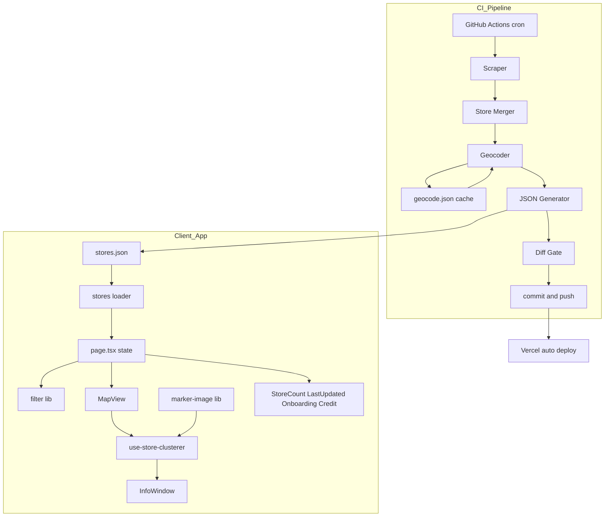
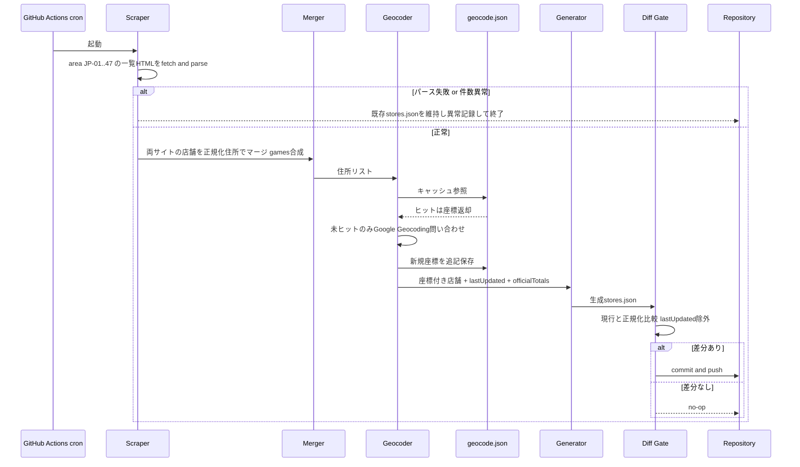
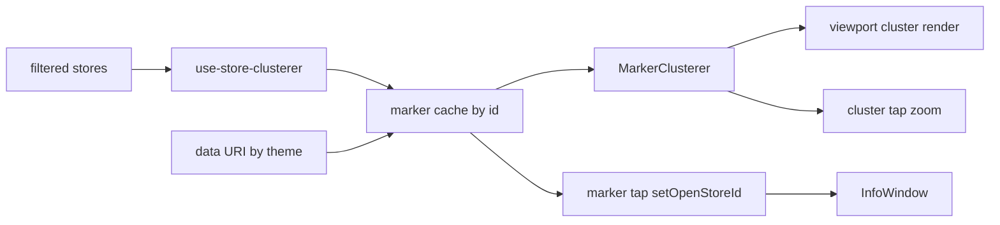

# 技術設計書: site-improvements

## Overview

本機能は、ラスサバ・イニブ設置店舗マップの既存サイトに対し、事前相談で合意した改善点を一括導入する。価値は3点に集約される: (1) 多数ピンでも快適に動作する**描画パフォーマンス**、(2) 人手を介さず公式情報に追従し全国対応する**データ自動更新**、(3) 店舗数・更新日時・チュートリアル等の**情報提示の充実**。

対象ユーザーはスマホ中心のアーケードゲーマー（描画性能・情報提示の受益者）とサイト運営者（自動更新の受益者）。アーキテクチャの大前提として、ステアリング（`tech.md`）の**サーバーレス静的Webアプリ**方針を維持する。ランタイムAPI・DBは導入せず、データ鮮度はビルド前のオフラインパイプライン（GitHub Actions）で担保する。

**Impact**: 現状の「手書き `stores.ts`・1店舗=1 Reactマーカー・関東限定」を、「自動生成 `stores.json`・命令的クラスタ描画・全国対応」へ変更する。既存のカリング/フィルタ/住所パース資産は活用または置換する。

### Goals
- 全国規模の店舗数でもスムーズに動作する地図描画（クラスタリング + 軽量画像マーカー）
- サーバーレスを維持したままの定期データ自動更新（スクレイプ→ジオコーディング→再生成→自動デプロイ）
- 対応エリアの全国化（自動更新パイプラインに内包）
- 店舗数・最終更新日時・初回オンボーディング・データ出典の情報提示
- DB非採用方針の明文化と、タスク粒度・コミット規約の遵守

### Non-Goals
- ランタイムDB・APIサーバーの導入（将来のユーザー投稿機能まで保留）
- リアルタイム更新（cron間隔での反映に留める）
- 公式サイトの座標APIの直接利用（住所ジオコーディングで代替）
- 既存の手書き `stores.ts` のID体系（`tokyo-001` 等）の維持（決定論的ハッシュIDへ移行）

## Architecture

### Existing Architecture Analysis

- **構成**: Next.js 16 App Router / TypeScript strict / Vercel。ランタイムAPI・DBなし。状態は `page.tsx` のローカル `useState`。
- **地図描画**: `@vis.gl/react-google-maps` v1.7（`Map`/`AdvancedMarker`/`InfoWindow`/`useMap`）。1店舗=1 `AdvancedMarker`（`StoreMarker`、`memo`化）。
- **既存の最適化資産**: ビューポートカリング（`use-visible-stores`、`idle`イベント + 純関数 `filterStoresByBounds`）、共有SVGグラデ（`MapView` の `<defs>`）、テーマ色分け（`marker-color.ts`）。
- **データ**: 手書き静的TS `src/data/stores.ts`（239件・関東4県）。型は `src/types/store.ts` の `Store`。
- **保つべき境界**: ロジックは純関数として `src/lib/` に分離（フィルタ・カリング・住所パース）。コンポーネントは単一責任。`@/` = `src/`。
- **置換される技術的負債**: 手動カリング（クラスタラのビューポートアルゴリズムへ統合）、宣言的Reactマーカー（命令的クラスタ管理へ）。

### Architecture Pattern & Boundary Map

選定パターンは2つの独立した境界からなる: **(A) ビルド前データ生成パイプライン**（Node/CI、ランタイム外）と **(B) クライアント地図描画**（既存アプリ内）。両者の唯一の接点は生成物 `src/data/stores.json` という**データ契約**である。これにより Req1（描画）と Req2/3（パイプライン）を並行実装可能にする。



**Architecture Integration**:
- **Selected pattern**: パイプラインは「Pipeline/Stages（スクレイプ→マージ→ジオコード→生成→差分ゲート）」、クライアントは「命令的アダプタ（`useMap` でGoogle Maps命令APIをReactに橋渡し）」。
- **Domain/feature boundaries**: パイプライン（`scripts/`・`.github/`）とアプリ（`src/`）は `stores.json` のデータ契約のみで結合。UI情報提示（Req4/5/6）は既存ボタン/モーダル規約の小コンポーネント追加に限定。
- **Existing patterns preserved**: 純関数の `src/lib/` 分離、住所パース（`address-parser.ts`）とフィルタ（`filter.ts`）は全国データでもそのまま流用、単一InfoWindow方式。
- **New components rationale**: クラスタ管理フック（命令APIの隔離）、マーカー画像生成（data URI化）、スクレイパ/ジオコーダ/生成器（パイプライン段）、情報提示UI群（新規要件）。
- **Steering compliance**: ランタイムDB/APIなし（tech.md）、スマホファースト、型安全strict、純関数分離。

### Technology Stack

| Layer | Choice / Version | Role in Feature | Notes |
|-------|------------------|-----------------|-------|
| Frontend | `@vis.gl/react-google-maps` ^1.7 (既存) | 地図描画・`useMap` 命令ブリッジ | 既存 |
| Frontend | `@googlemaps/markerclusterer` (新規) | マーカークラスタリング・ビューポート除外 | 命令的に利用 |
| Frontend | Next.js 16 / React 19 / Tailwind v4 (既存) | UI・情報提示コンポーネント | 既存 |
| Data / Storage | `src/data/stores.json` (新規形式) + 薄いTSローダ | 生成データ + メタ(lastUpdated/officialTotals) | 既存 `stores.ts` をローダ化 |
| Pipeline / Build | Node 20+ スクリプト群 (`scripts/`) | スクレイプ・マージ・ジオコード・生成 | ランタイム外 |
| Pipeline / Build | `node-html-parser` 等 軽量HTMLパーサ (新規 devDep) | 公式一覧HTMLのDOM抽出 | ヘッドレスブラウザ不要 |
| External Service | Google Geocoding API | 住所→座標変換（キャッシュ付き） | CI Secret 鍵・Maps鍵と分離 |
| Infrastructure | GitHub Actions (cron) (新規 `.github/workflows/`) | 定期実行・commit&push | Vercel自動デプロイ連動 |

> 詳細な選定根拠・比較（Nominatim 不採用理由、描画Option比較）は `research.md` 参照。

## System Flows

### データ更新パイプライン（Req2, 3, 5）



差分ゲートは `lastUpdated` を比較対象から除外することで、実体差分のない更新でコミットが発生しないようにする（Req2.7）。スクレイプ/パース失敗時は既存データを書き換えず異常記録のみ行う（Req2.6）。

### クライアント描画フロー（Req1）



クラスタラがビューポート外除外（Req1.6）とクラスタ集約/解除（Req1.1〜1.3）を担う。マーカーはid単位でキャッシュし、同一集合・同一範囲では再生成しない（Req1.7）。

## Requirements Traceability

| Requirement | Summary | Components | Interfaces | Flows |
|-------------|---------|------------|------------|-------|
| 1.1, 1.2, 1.3 | クラスタ集約/展開/解除 | use-store-clusterer | MarkerClusterer設定 | クライアント描画 |
| 1.4 | 軽量画像マーカー(data URI) | marker-image | `getMarkerDataUri(theme)` | クライアント描画 |
| 1.5 | テーマ色分け維持 | marker-image, marker-color | テーマ定義 | クライアント描画 |
| 1.6 | ビューポート除外維持 | use-store-clusterer | clusterer algorithm | クライアント描画 |
| 1.7 | 不要な再生成抑止 | use-store-clusterer | markerキャッシュ | クライアント描画 |
| 2.1, 2.2 | 公式スクレイプ(全国) | scraper | `scrapeStores()` | パイプライン |
| 2.3 | ジオコードキャッシュ | geocoder | `geocode()` + cache | パイプライン |
| 2.4, 2.7 | 差分検出/no-op | diff-gate, generator | `hasMeaningfulDiff()` | パイプライン |
| 2.5 | 自動デプロイ | workflow | git push | パイプライン |
| 2.6 | 失敗時非破壊 | scraper, validator | バリデーション | パイプライン |
| 2.8 | ランタイム非汚染 | (pipeline全体) | ビルド前隔離 | パイプライン |
| 3.1, 3.2 | 全国表示/取得 | scraper, loader | area JP-01..47 | パイプライン |
| 3.3 | 全国規模の描画性能 | use-store-clusterer | algorithm調整 | クライアント描画 |
| 3.4 | 全国住所フィルタ | (既存 address-parser/filter) | 流用 | - |
| 4.1, 4.2 | 店舗数/絞込件数表示 | StoreCount | props | - |
| 4.3 | 網羅率(should) | StoreCount, loader | officialTotals | - |
| 5.1 | lastUpdated埋込 | generator | JSONメタ | パイプライン |
| 5.2, 5.3 | 更新日時表示(ja形式) | LastUpdated | `Intl.DateTimeFormat` | - |
| 6.1, 6.2 | 初回オンボーディング | Onboarding | localStorageフラグ | - |
| 6.3 | 常設ヘルプ | HelpButton | - | - |
| 6.4 | 出典クレジット | Credit | - | - |
| 7.1, 7.3 | DB非採用明文化 | (steering/tech.md追記) | ドキュメント | - |
| 7.2 | 静的CDN配信維持 | loader | stores.json | - |
| 8.1〜8.4 | タスク粒度/コミット規約 | (開発プロセス) | tasks.md指針 | - |

## Components and Interfaces

| Component | Domain/Layer | Intent | Req Coverage | Key Dependencies (P0/P1) | Contracts |
|-----------|--------------|--------|--------------|--------------------------|-----------|
| stores loader | Data | JSON読込・型付けre-export | 3.1, 4.3, 5.2, 7.2 | stores.json (P0) | State |
| marker-image | Frontend/lib | テーマ別data URI生成 | 1.4, 1.5 | marker-color (P1) | Service |
| use-store-clusterer | Frontend/hook | 命令的クラスタ管理 | 1.1-1.3, 1.6, 1.7, 3.3 | useMap (P0), marker-image (P0) | State |
| MapView (改修) | Frontend/UI | 地図コンテナ・InfoWindow配線 | 1.1-1.7 | use-store-clusterer (P0) | State |
| StoreCount | Frontend/UI | 総数/絞込件数/網羅率表示 | 4.1-4.3 | loader (P1) | - |
| LastUpdated | Frontend/UI | 最終更新日時表示 | 5.2, 5.3 | loader (P1) | - |
| Onboarding + HelpButton | Frontend/UI | 初回案内/常設ヘルプ | 6.1-6.3 | localStorage (P1) | State |
| Credit | Frontend/UI | データ出典明示 | 6.4 | - | - |
| scraper | Pipeline | 公式一覧HTML抽出 | 2.1, 2.2, 2.6, 3.2 | node-html-parser (P0) | Batch |
| store-merger | Pipeline | 住所マージ/games合成/ID採番 | 2.3, 2.4 | - | Service |
| geocoder | Pipeline | 住所→座標(キャッシュ) | 2.3 | Google Geocoding (P0), geocode.json (P0) | Service |
| json-generator + diff-gate | Pipeline | JSON生成/差分判定 | 2.4, 2.7, 5.1 | - | Batch |
| workflow | Infra | cron実行/commit&push | 2.5, 2.6 | GitHub Actions (P0) | Batch |

### Data Layer

#### stores loader (`src/data/stores.ts` 改修)
| Field | Detail |
|-------|--------|
| Intent | 生成 `stores.json` を読み込み型付けして re-export する薄いローダ |
| Requirements | 3.1, 4.3, 5.2, 7.2 |

**Responsibilities & Constraints**
- `stores.json` を import し `Store[]` とメタ情報を型安全に公開。既存の `import { stores } from '@/data/stores'` 互換を維持。
- データ所有: アプリ側はread-only。書き込みはパイプラインのみ。

**Contracts**: State [x]

##### State Management
- 公開: `stores: Store[]`、`storesMeta: StoresMeta`。
```typescript
interface StoresMeta {
  lastUpdated: string          // ISO 8601 (生成時刻)
  source: { jojols: string; gundam: string }  // 出典URL
  officialTotals?: { jojols: number; gundam: number }  // 網羅率算出用 (任意)
}
```
- 永続化: ビルド時バンドル → CDNエッジ配信（Req7.2）。整合性: 生成は決定論的、再生成で同一住所→同一ID。

**Implementation Notes**
- Integration: `page.tsx` は `storesMeta` を `StoreCount`/`LastUpdated`/`Credit` へ props で配線。
- Validation: JSONは `Store` 型に適合（生成器側で保証）。
- Risks: JSON import の型は生成器とローダで二重定義しない（共有 `Store` 型を参照）。

### Frontend (地図描画)

#### marker-image (`src/lib/marker-image.ts`)
| Field | Detail |
|-------|--------|
| Intent | テーマ別のピン画像を SVG文字列→data URI でモジュール読込時に1回生成 |
| Requirements | 1.4, 1.5 |

**Responsibilities & Constraints**
- 既存のグラデ/色分け（both=紫, gundamOnly=青, closed=グレー+🌸）をSVG文字列に移植し data URI 化（Req1.5）。**閉店（`closed`）と移設（`delisted`）は別状態**として扱う: `closed`（恒久閉店・手動判定）は現行どおりグレー+🌸を維持し、`delisted`（公式一覧から消失＝移設/撤去の可能性・自動検出）はただのグレーピン（絵文字なし）として新規追加する。ピンはグレー無装飾だが、**表示ラベル/InfoWindow では「移設？」**（？で不確定を含意）と表示する。表示優先は `closed`（🌸）> `delisted`（移設？・グレー）> ゲーム別色。
- 純粋・副作用なし。テーマごとに一度だけ生成しキャッシュ。

**Contracts**: Service [x]

##### Service Interface
```typescript
type MarkerThemeKey = 'both' | 'gundamOnly' | 'closed' | 'delisted'

interface MarkerImage {
  url: string      // data:image/svg+xml,...
  width: number
  height: number
}

interface MarkerImageService {
  getMarkerImage(theme: MarkerThemeKey): MarkerImage
}
```
- Preconditions: `theme` は既知の4種（both/gundamOnly/closed/delisted）。
- Postconditions: 同一 `theme` には同一参照を返す（再生成なし）。
- Invariants: 出力は決定論的、DOM非依存（SSR安全）。

**Implementation Notes**
- Integration: `use-store-clusterer` が `AdvancedMarkerElement.content`（``）へ `url` を設定。
- Risks: 🌸（closed の絵文字）はSVG `<text>` で埋め込み、フォント差異による見え方の差は許容。delisted は絵文字なしのグレーピンのため影響なし。

#### use-store-clusterer (`src/hooks/use-store-clusterer.ts`)
| Field | Detail |
|-------|--------|
| Intent | `useMap` 経由でGoogle Maps命令APIを隔離し、クラスタとマーカーのライフサイクルを管理 |
| Requirements | 1.1, 1.2, 1.3, 1.6, 1.7, 3.3 |

**Responsibilities & Constraints**
- 表示対象 `Store[]` を受け取り、`AdvancedMarkerElement` を生成/再利用して `MarkerClusterer` に供給。
- クラスタ集約/展開/解除（Req1.1-1.3）とビューポート除外（Req1.6）はクラスタラのビューポートアルゴリズムに委譲。
- マーカーは `store.id` 単位でキャッシュし、同一集合・同一範囲で再生成しない（Req1.7）。store配列変化時のみ差分追加/削除。
- マーカークリックで `onMarkerClick(storeId)` を発火（InfoWindow連携はMapView側）。
- **フォーカス連携（検索/住所選択との両立）**: `focusMarker(storeId)` を公開する。指定店舗の座標へ `panTo` し、当該マーカーが個別表示される `maxZoom` 以上へズームしてクラスタを解除する。低ズームでクラスタに埋もれた店舗でも、検索・住所選択からのフォーカス遷移で到達し InfoWindow を開けるようにする（既存 `focusStore` 経路との接続点）。

**Dependencies**
- Inbound: MapView — 表示対象stores・クリックハンドラを供給 (P0)
- Outbound: marker-image — data URI取得 (P0)
- External: `@googlemaps/markerclusterer` — クラスタ生成/レンダラ (P0); `@vis.gl/react-google-maps` `useMap` — map取得 (P0)

**Contracts**: State [x]

##### State Management
```typescript
interface UseStoreClustererParams {
  stores: Store[]
  onMarkerClick: (storeId: string) => void
}

interface StoreClustererHandle {
  // 指定店舗へ pan/zoom してクラスタを解除し、当該マーカーを個別表示状態にする。
  // 検索/住所選択経由で InfoWindow を開く前段として MapView から呼ぶ。
  focusMarker: (storeId: string) => void
}

// 内部で marker cache (Map<string, AdvancedMarkerElement>) と
// MarkerClusterer インスタンスを ref 管理し、命令ハンドルを返す。
function useStoreClusterer(params: UseStoreClustererParams): StoreClustererHandle
```
- State model: `markersRef: Map<storeId, AdvancedMarkerElement>`、`clustererRef: MarkerClusterer`。
- 同時実行: Reactレンダリングと地図イベントの整合は `useEffect` 依存配列（`map`, `stores`）で制御。
- 永続化: なし（描画状態のみ）。

**Implementation Notes**
- Integration: `map` 取得後に clusterer を初期化。`stores` 変化時に追加/削除分のみ反映し `clusterer.addMarkers/removeMarkers`。アンマウントで `clusterer.clearMarkers()`。
- Validation: 全国規模データで gridSize/maxZoom を実測調整（Req3.3）。
- Risks: 命令APIとReact stateの同期ずれ → marker cache をフックに一元化し単体テスト（純粋部分の差分計算を関数抽出）。

#### MapView (`src/components/MapView.tsx` 改修)
- **Summary-only**（既存コンテナの再配線）。`StoreMarker` の宣言的描画を撤去し `useStoreClusterer` を呼び出す。`openStoreId` state と単一 `InfoWindow` は維持し、`onMarkerClick` で開く。
- **フォーカス/検索連携**: 既存の `focusStore`（検索・住所選択からの遷移。Phase2/3 で追加された `focusStore`/`onFocusConsumed`）受信時は、クラスタラの `focusMarker(storeId)` を呼んで pan/zoom→de-cluster した上で `openStoreId` を当該店舗にセットし InfoWindow を開く。完了後に `onFocusConsumed` を発火（既存規約）。これにより低ズームでクラスタに埋もれた店舗も検索から開ける。
- Implementation Note: 既存の `use-visible-stores` 呼び出しを撤去（クラスタラが内包）。`userLocation` の `panTo` ロジックは維持。

> **撤去対象**: `src/components/StoreMarker.tsx`、`src/hooks/use-visible-stores.ts`（および関連テスト）。共有SVGグラデ `<defs>` は marker-image に移行後、未使用なら撤去。

### Frontend (情報提示UI)

共通: 既存のボタン/モーダル規約（`AddressFilterButton`/`SearchButton`/`LocateButton`/`AddressFilterModal`）を踏襲。以下はすべて **Summary-only**（新規境界なし）。

- **StoreCount** (`src/components/StoreCount.tsx`) — Req4.1-4.3。`total`/`filtered`/任意の `officialTotal` を props で受け、件数と網羅率（officialTotal がある場合のみ）を表示。
- **LastUpdated** (`src/components/LastUpdated.tsx`) — Req5.2, 5.3。`Intl.DateTimeFormat('ja-JP', { dateStyle:'medium', timeStyle:'short' })` で整形表示。
- **Onboarding + HelpButton** (`src/components/Onboarding.tsx`) — Req6.1-6.3。`localStorage` フラグ（例 `ls-exvs-onboarded`）を `useEffect` 内で参照し初回のみ自動表示。常設「?」ボタンで再表示可能。
- **Credit** (`src/components/Credit.tsx`) — Req6.4。出典（公式2サイト）へのクレジット/リンクを常設表示。`storesMeta.source` を利用。

**Implementation Notes（情報提示UI共通）**
- Integration: `page.tsx` に props を追加配線。`total = stores.length`、`filtered = filteredStores.length` は既に算出済み。
- Validation: localStorage参照は `useEffect` 限定でSSR/hydration安全（Req6.2、ちらつき対策）。
- Risks: モバイル画面の情報過多 → 件数/更新日時/出典はコンパクトな1箇所に集約配置。

### Pipeline (ビルド前データ生成)

#### scraper (`scripts/scrape.ts`)
| Field | Detail |
|-------|--------|
| Intent | 公式2サイトの地域別一覧HTMLから店舗(名前/住所/台数/loc_id)を抽出 |
| Requirements | 2.1, 2.2, 2.6, 3.2 |

**Responsibilities & Constraints**
- area コード JP-01〜JP-47（東京は `&sw=1`/`&sw=0`）を列挙し各 `./list?area=...` をfetch、DOMパースで店舗抽出。
- **area単位で成否・件数を記録**し、後段（merger）へ「今回正常取得できた area 集合（`scrapedAreas`）」を伝搬する。
- 失敗・件数異常（0件/既存比急減）時は例外で中断し既存データを保護（Req2.6）。

**Contracts**: Batch [x]

##### Batch / Job Contract
- Trigger: パイプライン起動時（workflow）。
- Input / validation: なし（公式URL固定）。**area単位**で出力件数を閾値バリデーション。個別 area が取得失敗（例外/0件/既存比急減）した場合は当該 area を「不確定」とマークし `scrapedAreas` から除外（その area の店舗には移設判定 `delisted` を適用しない）。全国総数が既存比で極端に減少した場合は全体を異常として中断。
- Output: `{ stores: RawStore[]; scrapedAreas: Set<string> }`（`RawStore = { site, locId, name, address, machineCount, area }`）。
- Idempotency & recovery: 純取得。全体失敗時は非破壊で中断。部分失敗は不確定 area として記録し既存データを維持。

#### store-merger (`scripts/merge.ts`)
| Field | Detail |
|-------|--------|
| Intent | 両サイトの店舗を正規化住所でマージし `games[]` 合成・決定論的ID採番 |
| Requirements | 2.3, 2.4 |

**Contracts**: Service [x]
```typescript
interface MergeService {
  normalizeAddress(raw: string): string          // 統合キー生成（純関数・単体テスト必須）
  mergeStores(input: {                            // 正規化住所キーで統合 + 移設判定
    raw: RawStore[]
    prev: Store[]                                 // 前回 stores.json（移設判定の基準）
    scrapedAreas: Set<string>                     // 今回正常取得できた area 集合
  }): MergedStore[]
  deriveId(normalizedAddress: string): string    // 決定論的ハッシュID
}
```
- Invariants: 同一正規化住所 → 同一 `id`・統合された `games`。再生成で安定（Req2.4）。

##### 住所正規化仕様（統合キーの黒箱化を防ぐ）
パイプラインの正確性（クロスサイトのマージ・決定論的ID・ジオコードキャッシュキー）は `normalizeAddress` の決定論性に全面依存するため、仕様を明示し単体テストで固定する。
- **文字種統一**: 全角英数字→半角、全角空白→半角、前後/連続空白の除去。
- **番地表記統一**: `丁目`/`番`/`番地`/`号` と各種ハイフン（`-`/`－`/`―`/`ー`）を単一の `-` へ正規化（例 `新宿3丁目22-12` → `新宿3-22-12`）。
- **建物名の扱い**: **統合キーには含めない**（同一住所でのビル名表記揺れによる別店舗誤認を防ぐ）。表示用 `name`/`address` には保持するが、マージキー・ID・ジオコードキャッシュキーは「丁目-番地レベル」まで。
  - 衝突回避: 同一番地に複数店舗が同居する場合（大型ビル内テナント等）は店舗名でサブキー化（`normalizedAddress + '|' + normalizedName`）。
- **クライアント `address-parser.ts` との関係**: クライアントの `parseAddress`（都道府県/市区町村/区の階層抽出・フィルタ用）とは目的の異なる別関数。両者は独立で良いが、全角/半角・空白の前処理だけは共通の最小ユーティリティに切り出し齟齬を防ぐ。
- **移設判定（`delisted`、閉店とは別）**: `prev` に存在し直近スクレイプに無い店舗は削除せず `delisted: true` を付与して保持（グレーピン、ラベルは「移設？」）。これは公式一覧からの消失＝移設/撤去の可能性であり、**手動の `closed`（閉店・🌸）とは別状態**（両者が重なる場合は `closed` を優先表示）。ただし**当該店舗の area が `scrapedAreas` に含まれる（今回正常取得できた）場合のみ判定**し、取得失敗 area の店舗は前回状態を維持する（誤った一斉 `delisted` 付与を防止、Req2.6 を area 粒度でも担保）。詳細は research.md「公式非掲載店舗（移設）の扱い」参照。

#### geocoder (`scripts/geocode.ts`)
| Field | Detail |
|-------|--------|
| Intent | 住所→座標変換。`scripts/cache/geocode.json` キャッシュで再問い合わせ回避 |
| Requirements | 2.3 |

**Contracts**: Service [x]
```typescript
interface GeocodeCache { [normalizedAddress: string]: { lat: number; lng: number } }

interface GeocoderService {
  geocode(address: string): Promise<{ lat: number; lng: number }>  // キャッシュ優先
}
```
- Preconditions: 環境変数 `GOOGLE_GEOCODING_API_KEY`。
- Postconditions: 新規住所のみAPI問い合わせ、結果をキャッシュへ追記し commit 対象に含める（Req2.3）。
- 外部依存: Google Geocoding REST。詳細は `research.md`。

#### json-generator + diff-gate (`scripts/generate.ts`)
| Field | Detail |
|-------|--------|
| Intent | `stores.json`(stores+メタ)生成と実体差分判定 |
| Requirements | 2.4, 2.7, 5.1 |

**Contracts**: Batch [x]
- Output: `src/data/stores.json` = `{ lastUpdated, source, officialTotals?, stores }`。`lastUpdated` を生成時刻で埋込（Req5.1）。
- Idempotency: 現行JSONと生成JSONを正規化比較（`lastUpdated` 除外）。差分なしなら書込/コミットしない（Req2.7）。
```typescript
function hasMeaningfulDiff(current: StoresFile, next: StoresFile): boolean
```

#### workflow (`.github/workflows/update-stores.yml`)
| Field | Detail |
|-------|--------|
| Intent | cron実行・スクリプト連鎖・差分時 commit&push |
| Requirements | 2.5, 2.6 |

**Contracts**: Batch [x]
- Trigger: cron（例: 1日1回）+ 手動 `workflow_dispatch`。
- Secrets: `GOOGLE_GEOCODING_API_KEY`。
- Recovery: スクリプト失敗時はコミットせず終了しログ記録（Req2.6）。push成功でVercel自動デプロイ（Req2.5）。
- コミット規約: `feat:`/`fix:` + 日本語要約（例 `chore: 設置店舗データを自動更新`）（Req8.3）。

## Data Models

### Domain Model
- **Store**（集約ルート）: `id`/`name`/`address`/`lat`/`lng`/`games`/`closed?`/`delisted?`。物理店舗1件 = 1集約。同一性 = 正規化住所。**型追加**: 既存 `closed?: boolean`（閉店・手動・🌸 表示）は**そのまま維持**し、新たに `delisted?: boolean`（公式一覧から消失＝移設/撤去の可能性・自動検出・グレーピン＋ラベル「移設？」）を追加する。閉店と移設は別状態で、表示優先は `closed`（🌸）> `delisted`（移設？・グレー）> ゲーム別色。`src/types/store.ts` への `delisted` 追加と `marker-color.ts` のテーマキー追加（`closed` は不変、`delisted` を追加）を伴う。Req1.5 の視覚的識別は維持。
- **StoresFile**（生成物のルート）: メタ情報 + `Store[]`。
- **GeocodeCache**: 正規化住所 → 座標。パイプライン専有の値オブジェクト集合。

### Logical Data Model
- `StoresFile.stores[*].id` は正規化住所ハッシュ（自然キー由来の決定論的代理キー）。
- 参照整合性: `geocode.json` のキー（正規化住所）と `Store.address` の正規化結果が対応。
- 時間的側面: `lastUpdated` で版を表現（DB versioning は不要）。

```typescript
interface StoresFile {
  lastUpdated: string
  source: { jojols: string; gundam: string }
  officialTotals?: { jojols: number; gundam: number }
  stores: Store[]   // src/types/store.ts の既存 Store を再利用
}
```

### Data Contracts & Integration
- **パイプライン→アプリ**: `stores.json`（JSON）。スキーマは `StoresFile`。後方互換: `Store` 型は不変、メタはアプリ側で任意参照。
- バリデーション: 生成器が `Store` 必須フィールド（lat/lng数値・games非空）を保証。ローダは型アサートのみ。

## Error Handling

### Error Strategy
パイプラインは **fail-safe（非破壊優先）**、クライアントは **graceful degradation**。

### Error Categories and Responses
- **パイプライン取得失敗（scraper/geocoder）**: 例外で中断 → 既存 `stores.json` 維持・コミットなし・CIログにエラー（Req2.6）。
- **件数異常（急減/0件）**: **area単位**で検証。個別 area の失敗/0件はその area を `scrapedAreas` から除外し、当該 area の店舗には移設判定（`delisted`）を適用せず前回値を維持（誤った一斉 `delisted` 付与を防止）。全国総数が既存比で極端に減少した場合のみ全体を異常終了。閾値はログ可視化し手動上書き手段を残す。
- **ジオコード失敗（個別住所）**: 当該店舗をスキップしログ記録（全体は継続）。次回再試行（キャッシュ未登録のまま）。
- **クライアント（地図/データ欠落）**: マーカー画像生成やクラスタ初期化失敗時も地図自体は表示継続。`storesMeta` 欠落時は件数/更新日時表示を省略。

### Monitoring
- CI: GitHub Actions のジョブログとステータス（失敗時通知）。差分件数・新規ジオコード件数をログ出力。

## Testing Strategy

### Unit Tests
- `marker-image.getMarkerImage`: 4テーマ（both/gundamOnly/closed/delisted）で決定論的な data URI を返し、同一テーマで同一参照。closed=🌸付きグレー、delisted=絵文字なしグレーを区別（1.4, 1.5）。
- `store-merger.normalizeAddress`: 全角/半角・空白・丁目番地表記の揺れを同一キーへ正規化し、建物名差は統合キーに影響しない（同一番地＋別店舗名は別キー）（2.4）。
- `store-merger.mergeStores`/`deriveId`: 同一住所の両サイト掲載が1件に統合され games が合成、再実行でID不変。取得失敗 area（`scrapedAreas` 外）の店舗は移設判定（`delisted`）されず前回値を維持。`closed`（閉店）は本パイプラインで変更されない（2.3, 2.4, 2.6）。
- `generate.hasMeaningfulDiff`: `lastUpdated` のみ差分は false、実体差分は true（2.7）。
- 既存 `filter`/`address-parser`/カリング純関数: 全国住所サンプルで回帰（3.4）。

### Integration Tests
- `geocoder`: キャッシュヒット時はAPI未呼び出し、未ヒットのみ呼び出しキャッシュ追記（2.3）— APIモック。
- `scraper`: 固定HTMLフィクスチャから店舗抽出、件数異常で例外（2.1, 2.6）。
- パイプライン結合: フィクスチャ→merge→geocode(モック)→generate が妥当な `StoresFile` を生成（2.4, 5.1）。

### E2E/UI Tests（任意・手動確認可）
- クラスタ表示→タップでズーム→個別ピン→タップでInfoWindow（1.1-1.3）。
- 初回オンボーディング表示→閉じる→再訪で非表示、?ボタンで再表示（6.1-6.3）。
- フィルタ適用で件数表示が更新（4.2）。

### Performance
- 全国規模（数百〜数千件想定）でのパン/ズーム時のフレーム維持。gridSize/maxZoom 調整の実測（1.3, 3.3）。

## Performance & Scalability
- **目標**: 全国データでもスマホで地図操作がスムーズ（体感カクつきなし）。
- **手段**: クラスタリングによる描画数削減 + data URI画像化（Reactマーカー調整コスト排除、Req1.4）+ ビューポートアルゴリズムによる範囲外除外（Req1.6）。
- **トレードオフ**: 命令的管理の複雑化を、フックへの隔離と純関数化したマーカー差分計算で吸収。

## Security Considerations
- **Geocoding APIキー**: Maps表示用キーと分離し CI Secret 管理。CI鍵はGeocoding APIのみ・必要に応じてIP制限。`stores.json` には座標のみ格納し鍵を残さない。
- **スクレイピング**: 公式サイトへの過度な負荷を避け、リクエスト間隔を空ける。出典クレジットを明示（Req6.4）。

## Migration Strategy
- 既存 `stores.ts`（手書き239件・関東）→ 自動生成 `stores.json`（全国）への一度きりの切替。初回はパイプラインを手動実行（`workflow_dispatch`）して全件ジオコード・キャッシュ構築。
- `StoreMarker`/`use-visible-stores` の撤去はクラスタ実装の完了後に行い、段階的にコミット（Req8）。
- ロールバック: 生成 `stores.json` に問題があれば直前コミットへ revert（Vercel自動再デプロイ）。
