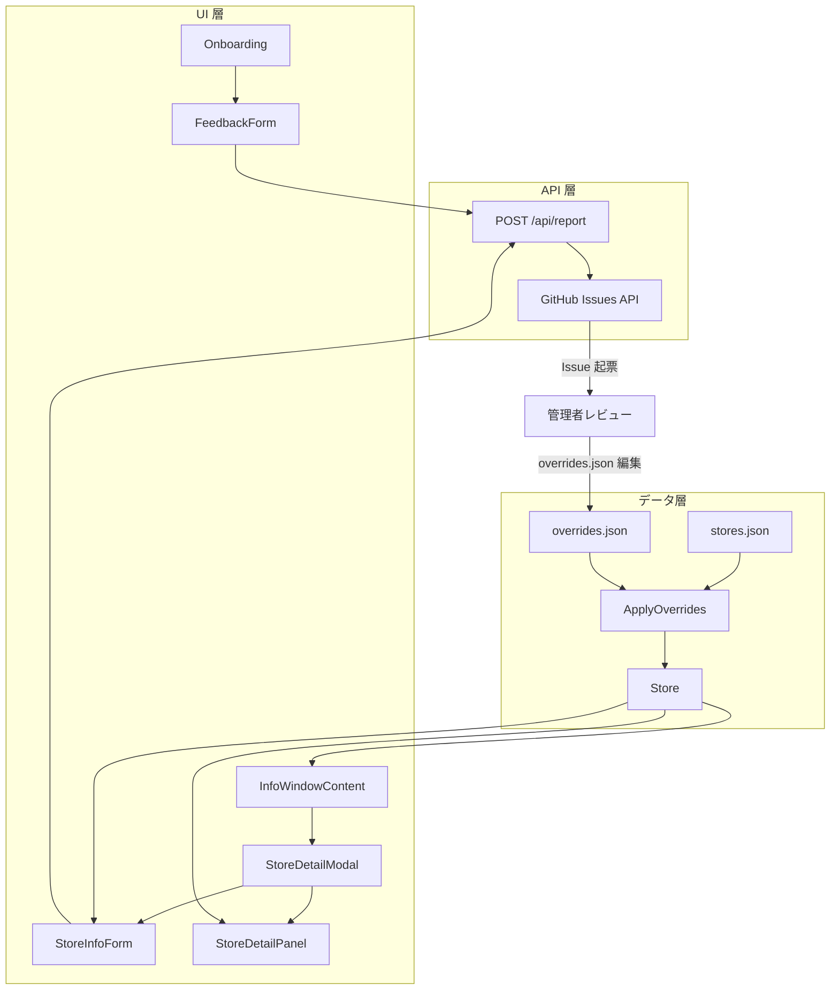
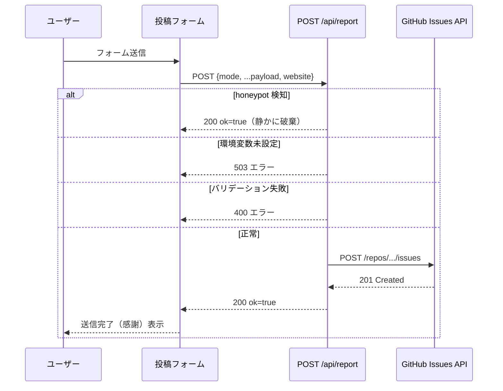
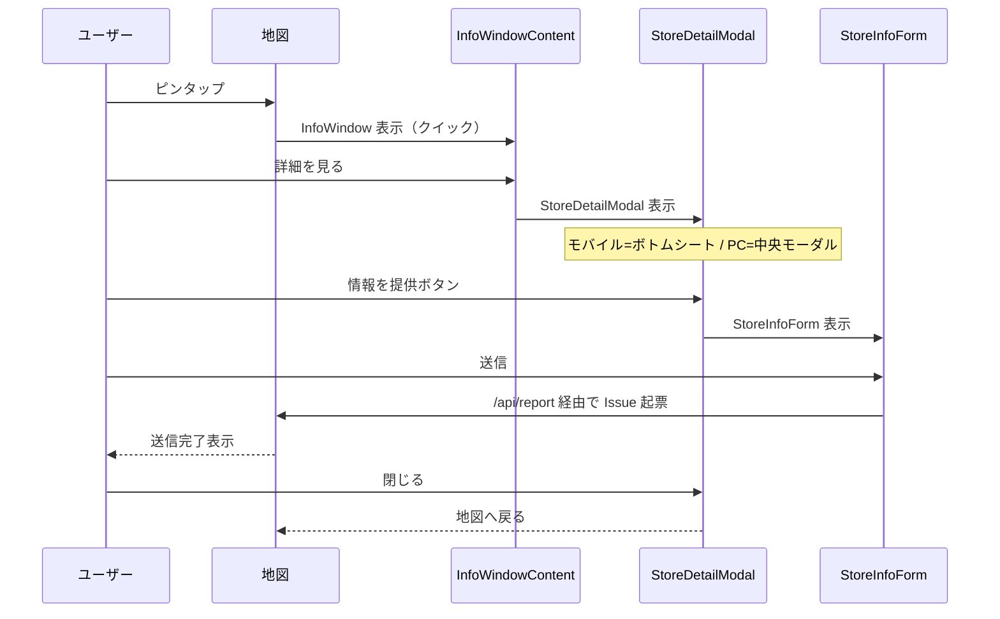

# 技術設計書: store-info-contribution (ver2.3)

## Overview

ver2.3 は、既存の「ユーザー投稿 → GitHub Issue → 管理者レビュー → 反映」パイプライン（`/api/report` + `buildReportIssue`）を共通基盤として、3つの機能を統合追加する。**(A) アプリ要望フォーム**（オンボーディングの X 投稿インテント廃止・差し替え）、**(B) 店舗モーダルの拡大表示**（InfoWindow クイック表示を維持しつつ詳細モーダルを追加）、**(C) 構造化店舗情報提供フォーム**（種別選択式を廃止し全属性一覧表示に統合）の3機能で構成される。

対象ユーザーは、ラスサバ・イニブをプレイするアーケードゲーマー（スマホ主体・ノンテック層）と運営者（管理者）の2者。認証基盤は導入せず、ランタイムでの店舗データ書き込みは行わない（静的データ方針維持）。

### Goals

- A: オンボーディングの X 投稿インテントを廃止し、アプリ内フォームで要望を GitHub Issue 化する
- B: 店舗ピンタップ後のクイック表示を維持しつつ、詳細展開（モバイル=ボトムシート / PC=中央モーダル）で情報量を増やす
- C: 全属性を一覧表示する構造化提供フォームで、未登録を空欄として可視化し提供意欲を高める
- 既存のリアルタイムフィルタ・検索・クラスター機能への影響ゼロ

### Non-Goals

- 口コミ・評価（主観的レビュー）投稿（ver3.0 以降）
- ユーザー認証
- ランタイムでの店舗データ書き込み
- ボトムシートのスワイプダウン close（ドラッグ操作は非スコープ）

---

## Architecture

### Existing Architecture Analysis

- `/api/report`: honeypot → バリデーション → env check → GitHub API call を行う既存 Route Handler
- `lib/report.ts`: `ReportInput` 型と `buildReportIssue()` を定義する共有ライブラリ（クライアント/サーバー両用）
- `Store` 型: `machineCounts`, `countSources` による台数 provenance 管理が先行実装済み
- `OverrideEntry` + `applyOverrides()`: 管理者が overrides.json を編集し、ランタイムで Store に重ねる手動反映層
- `InfoWindow` + `InfoWindowContent`: MapView 内部で Google Maps InfoWindow として描画するクイック表示
- `ReportModal`: fixed overlay の種別選択式フォーム（本 spec で構造化フォームに差し替え）
- `Onboarding.AboutPage`: X 投稿インテントリンク（本 spec で廃止・差し替え）

### Removed Components & Props

本 spec で削除・廃止するファイルと prop の一覧。実装時に必ず除去すること。

| 対象 | 種別 | 理由 |
|------|------|------|
| `src/components/ReportModal.tsx` | ファイル削除 | `StoreInfoForm` に完全差し替え |
| `MapView.reportStore` state | state 削除 | `detailStore` / `infoFormStore` に分割 |
| `InfoWindowContent.onReport` prop | prop 削除 | `onOpenDetail` に置換 |

**API レガシーパス (`mode: undefined`) の扱い**: UI からのエントリポイントは廃止するが、外部クライアントからの後方互換として API 側のレガシー処理は維持する。

---

### Architecture Pattern & Boundary Map

**採用パターン**: Layered Extension（既存パイプラインへのモード追加 + 既存 Store 型への属性追加 + 新 UI 層追加）



**境界と責務**:
- UI 層: ユーザー入力の収集と表示。状態管理は親（MapView / Onboarding）に委譲
- API 層: 入力検証・Issue 整形・GitHub API 呼び出し。クライアント非公開ロジック
- データ層: read-only 静的データ。ランタイム書き込み禁止（Req 6.4）

### Technology Stack

| Layer | 選択 | 役割 | 備考 |
|-------|------|------|------|
| UI | React 18, Next.js App Router | コンポーネント・状態管理 | 既存スタック継承 |
| スタイリング | Tailwind CSS | Bottom sheet・モーダル・フォーム | `md:` ブレークポイントでレスポンシブ切り替え |
| マップ | @vis.gl/react-google-maps, Google Maps JS API | InfoWindow クイック表示 | 既存スタック継承 |
| バックエンド | Next.js Route Handler | 投稿受付・バリデーション・GitHub API 呼び出し | `/api/report` 拡張 |
| 外部 API | GitHub Issues REST API v3 | Issue 起票 | 既存 GITHUB_REPORT_TOKEN / GITHUB_REPORT_REPO 継承 |

---

## System Flows

### 投稿フロー（3モード共通）



### 店舗詳細フロー



---

## Requirements Traceability

| Req | 要約 | コンポーネント | インターフェース | フロー |
|-----|------|----------------|-----------------|--------|
| 1.1 | 全フォームが Issue 化 | POST /api/report | mode 分岐 | 投稿フロー |
| 1.2 | メンション無効化 | neutralizeMentions | lib/report.ts | - |
| 1.3 | Honeypot | POST /api/report | website フィールド | 投稿フロー |
| 1.4 | 環境変数未設定エラー | POST /api/report | 503 レスポンス | 投稿フロー |
| 1.5 | SNS ID 有無で確定可否明示 | buildStructuredStoreIssue, buildFeedbackIssue | ReportIssue body | - |
| 1.6 | 送信完了表示 | FeedbackForm, StoreInfoForm | status state | 投稿フロー |
| 1.7 | 送信失敗表示 | FeedbackForm, StoreInfoForm | status state | 投稿フロー |
| 1.8 | 文字数上限 | POST /api/report | バリデーター | - |
| 2.1 | X インテント廃止・要望フォーム導線 | Onboarding.AboutPage | onOpenFeedback | - |
| 2.2 | 要望フォーム項目 | FeedbackForm | FeedbackInput | - |
| 2.3 | 要望 Issue 化 | FeedbackForm, POST /api/report | mode=feedback | 投稿フロー |
| 2.4 | 内容必須バリデーション | FeedbackForm | content required | - |
| 2.5 | Issue ラベル区別 | POST /api/report | FEEDBACK_LABEL | - |
| 3.1 | クイック表示（店名・住所・台数） | InfoWindowContent | Store | 店舗詳細フロー |
| 3.2 | 詳細展開導線 | InfoWindowContent | onOpenDetail callback | 店舗詳細フロー |
| 3.3 | モバイル=ボトムシート | StoreDetailModal | Tailwind md: | 店舗詳細フロー |
| 3.4 | PC=中央モーダル | StoreDetailModal | Tailwind md: | 店舗詳細フロー |
| 3.5 | 全属性表示 | StoreDetailPanel | Store | - |
| 3.6 | 未登録表示 | StoreDetailPanel | undefined チェック | - |
| 3.7 | 閉じて地図へ戻る | StoreDetailModal | onClose | 店舗詳細フロー |
| 3.8 | 経路・シェア等継承 | StoreDetailPanel | 既存 UI パーツ | - |
| 4.1 | type 式廃止・全項目一覧 | StoreInfoForm | StructuredStoreInput | - |
| 4.2 | 現在値初期表示 | StoreInfoForm | Store props | - |
| 4.3 | 属性入力受付 | StoreInfoForm | StructuredStoreInput | - |
| 4.4 | あり/なし/不明選択 | StoreInfoForm | TernaryState | - |
| 4.5 | 決済複数選択 | StoreInfoForm | payments: string[] | - |
| 4.6 | 通報をフォーム下部に配置 | StoreInfoForm | correctionType, correctionNote | - |
| 4.7 | SNS ID（任意）フォーム下部 | StoreInfoForm | reporter, noMention | - |
| 4.8 | 入力項目のみ送信 | StoreInfoForm | 未入力フィールドを除外 | - |
| 4.9 | 全未入力エラー | StoreInfoForm, POST /api/report | クライアント + サーバー検証 | - |
| 4.10 | 提案値一覧として Issue 整形 | buildStructuredStoreIssue | lib/report.ts | - |
| 5.1 | 新属性保持 | Store | StoreAttributeKey | - |
| 5.2 | 属性別 provenance 保持 | Store.attributeSources | Partial Record | - |
| 5.3 | 未確認属性の見た目 | StoreDetailPanel | attributeSources | - |
| 5.4 | 既存 countSources との整合 | Store, OverrideEntry, applyOverrides | 既存パターン踏襲 | - |
| 6.1 | 手動オーバーライド経由で反映 | applyOverrides, OverrideEntry | 既存層 | - |
| 6.2 | infoUpdatedAt 更新 | applyOverrides | OverrideEntry.updatedAt | - |
| 6.3 | 確定属性 provenance=admin | OverrideEntry.source | Provenance | - |
| 6.4 | ランタイム書き込み禁止 | （非機能制約） | - | - |
| 7.1–7.5 | 非機能制約 | 全コンポーネント | - | - |

---

## Components and Interfaces

### Summary Table

| Component | Layer | Intent | Req Coverage | Key Dependencies | Contracts |
|-----------|-------|--------|--------------|------------------|-----------|
| Store (型拡張) | Data | 新属性 + attributeSources 追加 | 5.1, 5.2, 5.4 | Provenance | State |
| OverrideEntry (型拡張) | Data | 新属性の admin 反映サポート | 6.1, 6.2, 6.3 | Store, Provenance | State |
| applyOverrides (拡張) | Lib | 新属性を Store に適用し attributeSources を記録 | 5.2, 5.4, 6.1–6.3 | Store, OverrideEntry | Service |
| lib/report.ts (拡張) | Lib | 新モード Issue 整形関数・型定義追加 | 1.1–1.8, 2.3, 2.5, 4.10 | neutralizeMentions | Service |
| POST /api/report (拡張) | API | 新モードのバリデーション・dispatch | 1.1–1.8 | lib/report.ts, GitHub API | API |
| FeedbackForm | UI | アプリ要望フォーム | 2.2–2.5, 1.1–1.8 | POST /api/report | State |
| Onboarding.AboutPage (修正) | UI | X インテント廃止・FeedbackForm 導線 | 2.1 | FeedbackForm | - |
| MapView (拡張) | UI | detailStore 状態管理 | 3.1–3.7 | StoreDetailModal, InfoWindowContent | State |
| InfoWindowContent (拡張) | UI | クイック表示に詳細展開ボタン追加 | 3.1, 3.2, 3.8 | Store | State |
| StoreDetailModal | UI | レスポンシブ詳細モーダル（ボトムシート/中央） | 3.3, 3.4, 3.7 | StoreDetailPanel, StoreInfoForm | State |
| StoreDetailPanel | UI | 全属性・provenance 表示（presentation） | 3.5, 3.6, 3.8, 5.3 | Store | - |
| StoreInfoForm | UI | 構造化提供フォーム（ReportModal 差し替え） | 4.1–4.9, 1.1–1.8 | Store, POST /api/report | State |

---

### Data Layer

#### Store 型拡張

| Field | Detail |
|-------|--------|
| Intent | 新店舗属性（営業時間・フロア・喫煙所・決済・録画台・配信台）と属性別 provenance の保持 |
| Requirements | 5.1, 5.2, 5.4 |

**Responsibilities & Constraints**
- 全新属性は任意（`?`）。既存フィールドへの変更は行わない
- `attributeSources` は `countSources` と同一 `Partial<Record<...>>` パターン。キー無し = provenance 不明（未登録）

**Contracts**: State [x]

##### State Management

```typescript
// src/types/store.ts に追加

export type TernaryState = 'yes' | 'no' | 'unknown'

export type StoreAttributeKey =
  | 'businessHours'
  | 'floor'
  | 'smoking'
  | 'payments'
  | 'hasRecording'
  | 'hasStreaming'

// Store インターフェースへ追加するフィールド:
// businessHours?: string           // 営業時間（例: "10:00-23:00"）
// floor?: string                   // フロア（例: "2F"）
// smoking?: TernaryState           // 喫煙所
// payments?: string[]              // 決済手段リスト（例: ["Suica", "PayPay"]）
// hasRecording?: TernaryState      // 録画台の有無
// hasStreaming?: TernaryState      // 配信台の有無
// attributeSources?: Partial<Record<StoreAttributeKey, Provenance>>
```

- **Persistence & consistency**: 静的データ方針。`stores.json` に含まれ、`applyOverrides` でオーバーライド値を重ねる

---

#### OverrideEntry 型拡張

| Field | Detail |
|-------|--------|
| Intent | 管理者が新属性を確定値として overrides.json に記録できるようにする |
| Requirements | 6.1, 6.2, 6.3 |

```typescript
// src/types/overrides.ts の OverrideEntry に追加するフィールド:
// businessHours?: string
// floor?: string
// smoking?: TernaryState
// payments?: string[]
// hasRecording?: TernaryState
// hasStreaming?: TernaryState
```

**Implementation Notes**
- `source` フィールドは既存のまま再利用（`admin` で確定値を示す）
- 適用時に `store.attributeSources[key] = entry.source` を記録する（applyOverrides 拡張で対応）

---

### Library Layer

#### lib/report.ts 拡張

| Field | Detail |
|-------|--------|
| Intent | 新投稿モード（structured-store / feedback）の型定義と Issue 整形関数を追加する |
| Requirements | 1.1–1.8, 2.3, 2.5, 4.10 |

**Dependencies**
- Internal: `neutralizeMentions` — 既存のメンション無害化（全新モードで適用、P0）

**Contracts**: Service [x]

##### Service Interface

```typescript
// src/lib/report.ts への追加

export type FeedbackCategory = '新機能の提案' | '既存機能の改善' | '不具合' | 'その他'

export interface FeedbackInput {
  category: FeedbackCategory
  content: string        // 必須・max 2000
  reporter?: string      // SNS ID（任意・max 80）
  noMention?: boolean
}

export type CorrectionType = '位置ズレ' | '閉店・移設'

export interface StructuredStoreInput {
  storeId: string           // max 200
  storeName: string         // max 200
  storeAddress: string      // max 200
  reporter?: string         // max 80
  noMention?: boolean
  // 店舗属性（すべて任意。未入力は送信しない）
  machineCountsJojoLs?: number          // 0–99 整数
  machineCountsGundamExvs?: number      // 0–99 整数
  businessHours?: string                // max 100
  floor?: string                        // max 50
  smoking?: TernaryState
  payments?: string[]                   // max 20 件、各 max 30 文字
  hasRecording?: TernaryState
  hasStreaming?: TernaryState
  // 修正・通報セクション（任意）
  correctionType?: CorrectionType
  correctionNote?: string               // max 500
}

export function buildFeedbackIssue(input: FeedbackInput): ReportIssue
export function buildStructuredStoreIssue(input: StructuredStoreInput): ReportIssue
```

- **Preconditions**: `neutralizeMentions` でエスケープ済みの値を Issue 本文に使用する
- **Postconditions**: `buildStructuredStoreIssue` は入力フィールドを「提案値一覧」テーブル形式で整形する

**Implementation Notes**
- `buildStructuredStoreIssue` は未入力フィールドを Issue 本文に含めない（Req 4.8）
- `buildFeedbackIssue` の Issue ラベルは `FEEDBACK_LABEL = 'アプリ要望'`（呼び出し側の route.ts で指定）
- `payments` 配列は `,` 区切りでまとめて Issue 本文に出力する

---

#### lib/apply-overrides.ts 拡張

| Field | Detail |
|-------|--------|
| Intent | 新属性（businessHours 等）を OverrideEntry から Store に適用し attributeSources を記録する |
| Requirements | 5.2, 5.4, 6.1–6.3 |

**Contracts**: Service [x]

##### Service Interface

```typescript
// 既存シグネチャ維持（引数・戻り値変更なし）
export function applyOverrides(stores: Store[], file: OverridesFile): Store[]

// applyEntry 内部拡張イメージ:
// ATTRIBUTE_KEYS: StoreAttributeKey[] を定義し、ループで新属性を適用
// attributeSources[key] = entry.source を記録
```

- **Invariants**: 既存の `machineCounts` / `countSources` / `closed` / `delisted` 等の処理は変更しない

---

### API Layer

#### POST /api/report 拡張

| Field | Detail |
|-------|--------|
| Intent | 新投稿モードのバリデーション・dispatch を追加し、共通の honeypot・env check・GitHub API 呼び出しを継承する |
| Requirements | 1.1–1.8 |

**Dependencies**
- Outbound: `lib/report.ts` — Issue 整形（P0）
- External: GitHub Issues REST API — Issue 起票（P0）

**Contracts**: API [x]

##### API Contract

| Method | Endpoint | Request | Response | Errors |
|--------|----------|---------|----------|--------|
| POST | /api/report | ReportRequest（下記参照） | `{ok: true}` | 400, 503, 502 |

**Request Union**:
```typescript
type ReportRequest =
  | ({ mode: 'structured-store' } & StructuredStoreInput & { website: string })
  | ({ mode: 'feedback' }         & FeedbackInput         & { website: string })
  | ({ mode?: undefined }         & ReportInput           & { website: string }) // 既存 legacy
```

**Mode Dispatch**:
- `mode === 'feedback'` → `validateFeedback` + `buildFeedbackIssue` + label `アプリ要望`
- `mode === 'structured-store'` → `validateStructuredStore` + `buildStructuredStoreIssue` + label `ユーザー報告`
- `mode === undefined` → 既存 `validateReport` + `buildReportIssue` + label `ユーザー報告`（legacy フォーム向け後方互換）

**Implementation Notes**
- honeypot・env check・GitHub API call は mode 不問で共通処理として維持する
- `validateStructuredStore`: 「全フィールドが未入力」を 400 として拒否する（Req 4.9）
- `payments` は配列長（max 20）と各要素の長さ（max 30）をサーバー側で検証する
- ログ prefix: `[report:structured-store]` / `[report:feedback]` で新モードを区別する

---

### UI Layer

#### FeedbackForm（新規コンポーネント）

| Field | Detail |
|-------|--------|
| Intent | アプリへの要望をフォームで受け付け、mode=feedback で Issue 化する |
| Requirements | 2.2, 2.3, 2.4, 2.5 |

**Contracts**: State [x]

##### State Management

```typescript
// src/components/FeedbackForm.tsx

interface FeedbackFormProps {
  onClose: () => void
}

// 内部 state:
// category: FeedbackCategory
// content: string
// reporter: string
// noMention: boolean
// website: string  // honeypot
// status: 'idle' | 'sending' | 'done' | 'error'
// errorMsg: string
```

**Implementation Notes**
- Integration: `Onboarding.AboutPage` から `onOpenFeedback` callback 経由で開く。`fixed inset-0 z-[60]` で ReportModal と同一レイヤ
- Validation: `content.trim()` が空の場合は送信前エラー（Req 2.4）
- `category` の選択肢: `['新機能の提案', '既存機能の改善', '不具合', 'その他']`

---

#### Onboarding.AboutPage 修正

**Summary-only** — 新コンポーネント境界はなし。

既存 `INFO_REPORT_URL` / `info_report_url` 定数と「Xで報告する」`<a>` タグを削除し、代わりに `FeedbackForm` を開くボタン（`<button>` + onOpenFeedback prop）を配置する。`AboutPage` は `onOpenFeedback: () => void` prop を受け取る。`OnboardingModal` → `Onboarding` 親で `FeedbackForm` の open 状態を管理する。

---

#### MapView 拡張

**Summary-only** — 既存境界の拡張のみ。

`reportStore: Store | null` state（既存）を 2 つに分割:
- `detailStore: Store | null`: `StoreDetailModal` 表示用（新規）
- `infoFormStore: Store | null`: `StoreInfoForm` 表示用

`InfoWindowContent` の `onReport` prop を `onOpenDetail: () => void` に変更。`StoreDetailModal` の `onReport` で `infoFormStore` をセットする。

**状態遷移の明示**: `StoreInfoForm.onClose` は `infoFormStore` のみをクリアする。`detailStore` は維持し、フォームを閉じると詳細モーダル（StoreDetailModal）に戻る。`detailStore` は `StoreDetailModal.onClose` が呼ばれたときのみクリアする。

---

#### InfoWindowContent 拡張

**Summary-only** — 既存コンポーネントへの prop 追加のみ。

```typescript
interface InfoWindowContentProps {
  store: Store
  onClose: () => void
  onOpenDetail: () => void  // 追加（旧 onReport を置換）
}
```

「詳細を見る」ボタンを経路・シェア行に追加（または下部に独立行で配置）。`onReport`（ReportModal を開く）は削除し、情報提供は詳細モーダル経由に一本化。

---

#### StoreDetailModal（新規コンポーネント）

| Field | Detail |
|-------|--------|
| Intent | レスポンシブな詳細モーダル。モバイル=ボトムシート / PC=中央モーダルを CSS-only で切り替える |
| Requirements | 3.3, 3.4, 3.7 |

**Contracts**: State [x]

##### State Management

```typescript
// src/components/StoreDetailModal.tsx

interface StoreDetailModalProps {
  store: Store
  onClose: () => void
  onOpenInfoForm: () => void  // StoreInfoForm を開く
}
```

**レスポンシブ CSS クラス**:
- モバイル（`md:` 未満）: `fixed bottom-0 inset-x-0 max-h-[85dvh] overflow-y-auto rounded-t-2xl bg-white shadow-xl`
- PC（`md:` 以上）: `md:inset-0 md:flex md:items-center md:justify-center` + 内側コンテナ `md:max-w-lg md:rounded-2xl`
- オーバーレイ: `fixed inset-0 bg-black/40 z-[60]`

**Implementation Notes**
- Integration: `MapView` の `detailStore` state で制御。`z-[60]` で InfoWindow より前面に
- Risks: InfoWindow（Google Maps DOM）との z-index 競合。`z-[60]` で確実に上位レイヤに配置する

---

#### StoreDetailPanel（新規コンポーネント・presentation）

| Field | Detail |
|-------|--------|
| Intent | 全店舗属性を provenance 付きで表示する。新規コンポーネント境界（表示のみ・副作用なし） |
| Requirements | 3.5, 3.6, 3.8, 5.3 |

```typescript
// src/components/StoreDetailPanel.tsx

interface StoreDetailPanelProps {
  store: Store
  onOpenInfoForm: () => void
  onClose: () => void
}
```

**属性表示ルール**:

| フィールド | 表示形式 | 未登録 | 未確認（user-report）|
|-----------|---------|--------|---------------------|
| 台数 | 既存 CountBadge 継承 | — | 既存薄色表示 |
| 営業時間 | `store.businessHours` | 「未登録」（灰色） | 値 + 「（未確認）」 |
| フロア | `store.floor` | 「未登録」（灰色） | 値 + 「（未確認）」 |
| 喫煙所 | あり / なし / 不明 | 「未登録」（灰色） | 値 + 「（未確認）」 |
| 決済/電子マネー | chip 列挙 | 「未登録」（灰色） | 値 + 「（未確認）」 |
| 録画台の有無 | あり / なし / 不明 | 「未登録」（灰色） | 値 + 「（未確認）」 |
| 配信台の有無 | あり / なし / 不明 | 「未登録」（灰色） | 値 + 「（未確認）」 |

provenance 判定: `store.attributeSources?.[key]` が `'user-report'` → 未確認表示。`undefined` または `'official'` / `'admin'` → 通常表示（未登録は値 undefined で別判定）。

既存の経路リンク・シェアボタン・おおよその位置注記・情報更新日（`infoUpdatedAt`）は `StoreDetailPanel` に移植して継承（Req 3.8）。

---

#### StoreInfoForm（新規コンポーネント・ReportModal 差し替え）

| Field | Detail |
|-------|--------|
| Intent | 全店舗属性を構造化フォームで受け付け、入力項目のみを structured-store モードで Issue 化する |
| Requirements | 4.1–4.9, 1.1–1.8 |

**Contracts**: State [x]

##### State Management

```typescript
// src/components/StoreInfoForm.tsx

interface StoreInfoFormProps {
  store: Store
  onClose: () => void
}

// 内部 state（各属性フィールド + 送信状態）:
// machineCountsJojoLs: string      // "" = 未入力
// machineCountsGundamExvs: string
// businessHours: string
// floor: string
// smoking: TernaryState | ''
// payments: string[]              // 選択済みの決済手段リスト
// hasRecording: TernaryState | ''
// hasStreaming: TernaryState | ''
// correctionType: CorrectionType | ''
// correctionNote: string
// reporter: string
// noMention: boolean
// website: string  // honeypot
// status: 'idle' | 'sending' | 'done' | 'error'
// errorMsg: string
```

**フォーム構成**:
1. 各属性フィールド（現在値で初期化、未登録は空欄・`store.xxx` を defaultValue として渡す）
2. `smoking` / `hasRecording` / `hasStreaming` は `<select>` で「— 未入力 — / あり / なし / 不明」
3. `payments` は固定選択肢からチェックボックス複数選択
4. 下部区切り線: 「修正・通報」セクション（`correctionType` select + `correctionNote` textarea）
5. `reporter` input + `noMention` checkbox（reporter が空でない時のみ表示）
6. honeypot input

**Validation**（Req 4.9）: 属性フィールド・correctionType・correctionNote すべてが未入力の場合、送信前にエラー表示。

**Implementation Notes**
- Integration: `StoreDetailModal` の `onOpenInfoForm` から開く。`fixed inset-0 z-[70]` で detail modal より前面
- Risks: `machineCountsJojoLs` は string state で管理し、送信時に `Number()` 変換・NaN チェックを行う

---

## Data Models

### Domain Model

```
Store（集約ルート）
├─ Core: id, name, address, lat, lng, games
├─ Machine counts: machineCounts, countSources          [既存]
├─ Status: closed, delisted, approximateLocation, infoUpdatedAt  [既存]
└─ Extended attributes (新規・任意):
   ├─ businessHours?: string
   ├─ floor?: string
   ├─ smoking?: TernaryState
   ├─ payments?: string[]
   ├─ hasRecording?: TernaryState
   ├─ hasStreaming?: TernaryState
   └─ attributeSources?: Partial<Record<StoreAttributeKey, Provenance>>

OverrideEntry（管理者反映層・既存）
├─ source, note, updatedAt, machineCounts, closed, delisted, ...  [既存]
└─ Extended attributes (新規・任意):  [Store と同一新フィールド]
```

**不変条件**:
- `attributeSources[key]` は `applyOverrides` でのみ書き込まれる（UI から直接書かない）
- `TernaryState` は `'yes' | 'no' | 'unknown'` の厳格な discriminated union

### Logical Data Model

**Provenance 管理の一貫性**:

| 属性 | provenance の記録先 | キー |
|------|---------------------|------|
| ゲーム別台数 | `Store.countSources[gameTitle]` | `GameTitle` |
| 新拡張属性 | `Store.attributeSources[attrKey]` | `StoreAttributeKey` |

どちらも `Partial<Record<..., Provenance>>` で統一。キーが存在しない場合は公式/未設定扱い。

### Data Contracts & Integration

**API Data Transfer — POST /api/report**

`mode: 'structured-store'` ペイロード（クライアント → サーバー）:
```
{
  mode: "structured-store",
  storeId: string (max 200),
  storeName: string (max 200),
  storeAddress: string (max 200),
  reporter?: string (max 80),
  noMention?: boolean,
  website: string,           // honeypot
  machineCountsJojoLs?: number (integer 0–99),
  machineCountsGundamExvs?: number (integer 0–99),
  businessHours?: string (max 100),
  floor?: string (max 50),
  smoking?: "yes" | "no" | "unknown",
  payments?: string[] (max 20 items, each max 30 chars),
  hasRecording?: "yes" | "no" | "unknown",
  hasStreaming?: "yes" | "no" | "unknown",
  correctionType?: "位置ズレ" | "閉店・移設",
  correctionNote?: string (max 500)
}
```

`mode: 'feedback'` ペイロード:
```
{
  mode: "feedback",
  category: "新機能の提案" | "既存機能の改善" | "不具合" | "その他",
  content: string (required, max 2000),
  reporter?: string (max 80),
  noMention?: boolean,
  website: string    // honeypot
}
```

---

## Error Handling

### Error Strategy

フォームはクライアント側で事前バリデーションを行い、サーバー到達前にエラーを検出する。サーバーはすべての入力を独立して検証し、クライアント検証の迂回に対して防御的に対応する。

### Error Categories and Responses

**User Errors (400)**:
- 内容・category 欠落（FeedbackForm Req 2.4）→ クライアントで事前検知・フォームエラー表示
- 全属性未入力（StoreInfoForm Req 4.9）→ クライアント + サーバー両方で検証
- `mode` 不明 / フィールド型不正 → 400 `{ error: '入力が正しくありません。' }`
- `machineCountsJojoLs` が整数でない → サーバー側 parseInt / isFinite チェック

**System Errors (503)**:
- `GITHUB_REPORT_TOKEN` / `GITHUB_REPORT_REPO` 未設定 → 既存ハンドリング継承

**External Errors (502)**:
- GitHub API 失敗 → 既存ハンドリング継承（`{ error: '送信に失敗しました。...' }`）

### Monitoring

新モード識別のログプレフィックス追加:
- `[report:structured-store]` — 構造化店舗情報モードのエラー
- `[report:feedback]` — アプリ要望モードのエラー

---

## Testing Strategy

### Unit Tests

- `buildFeedbackIssue()`: 各 category、SNS ID あり / なし、メンション中和
- `buildStructuredStoreIssue()`: 部分入力（一部フィールドのみ）、全未入力時のビルド動作、payments 配列整形、メンション中和
- `validateStructuredStore()`: 全未入力拒否、machineCount 非整数拒否、payments 配列長上限
- `applyOverrides()` 拡張: 新属性が Store に正しく適用されること、`attributeSources` が正しく記録されること

### Integration Tests

- `POST /api/report` (mode='feedback'): honeypot 検知・必須欠落 400・正常系 200
- `POST /api/report` (mode='structured-store'): honeypot 検知・全未入力 400・部分入力正常系

### E2E / UI Tests

- **FeedbackForm**: 送信 → 完了表示、content 空でバリデーションエラー
- **StoreDetailModal**: モバイル幅（< 768px）でボトムシート、PC 幅（≥ 768px）で中央モーダル
- **StoreInfoForm**: 一部フィールド入力で送信可能、全フィールド未入力でエラー

---

## Security Considerations

- `payments` 配列の各要素も `neutralizeMentions` でメンション中和する（Req 1.2）
- `payments` の固定選択肢はサーバーで allowlist 検証するのではなく、配列長・各要素長のみ検証する（選択肢の追加時にサーバー変更不要）
- `machineCountsJojoLs` / `machineCountsGundamExvs` は Number 変換後に `Number.isFinite()` + 範囲チェック（0–99）でバリデーションする（NaN / Infinity 攻撃対策）
- `StoreInfoForm` の `z-[70]` により detail modal（`z-[60]`）の背面に隠れないことを保証する
